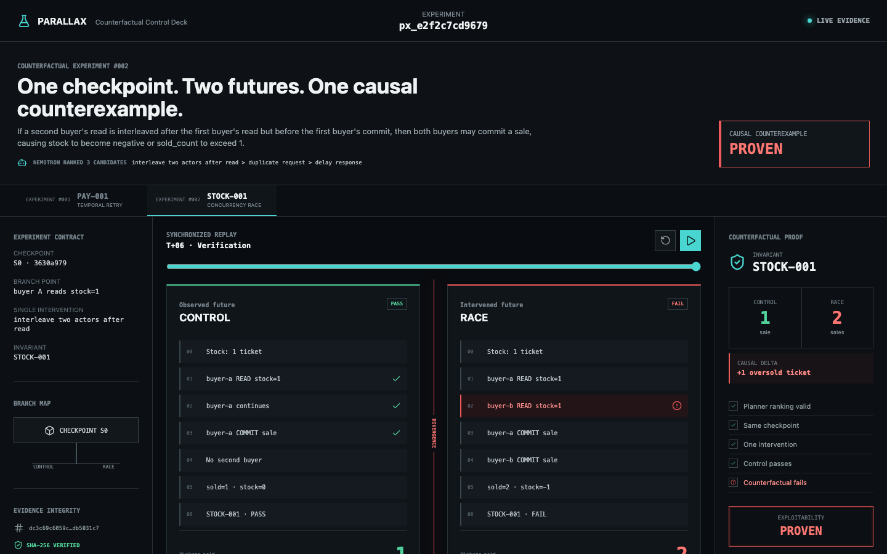
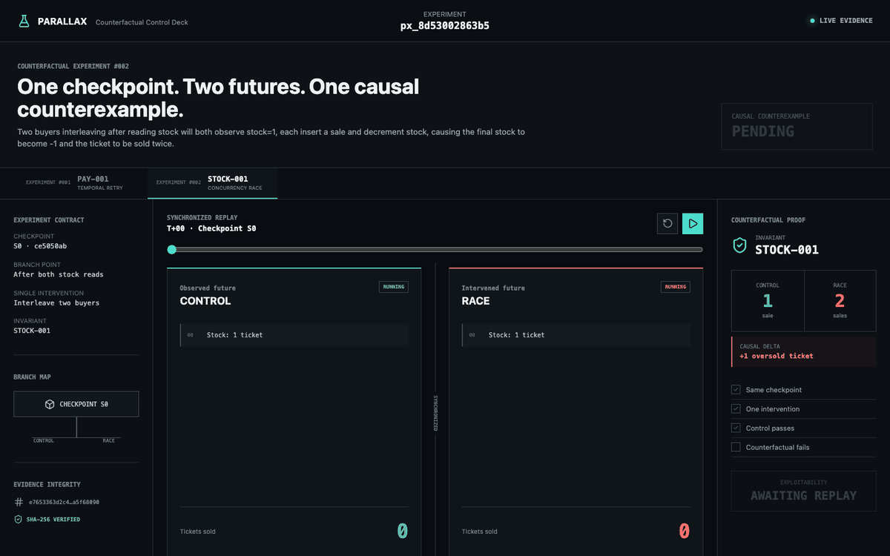
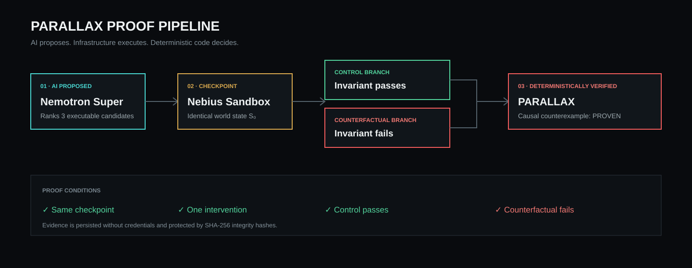

# PARALLAX

[](https://github.com/fran25ans/parallax/actions/workflows/ci.yml)
[](https://github.com/fran25ans/parallax/releases)
[](pyproject.toml)
[](LICENSE)

**PARALLAX proves software failures by executing alternate realities from the same checkpoint.**

> **Nemotron proposes. Nebius executes. PARALLAX proves.**

[**Open the live Counterfactual Control Deck**](https://fran25ans.github.io/parallax/)

AI usually explains why software *might* fail. PARALLAX creates a control future
and a counterfactual future from one identical application state, changes one
event, and lets deterministic invariants decide whether the alternate timeline
contains a real causal failure.



## The proof in 15 seconds



1. **Nemotron Super** reads an application manifest, ranks three interventions
   from six executable capabilities, and selects one bounded experiment.
2. **Nebius Sandboxes** checkpoints the application and executes two branches.
3. The control branch preserves normal behavior.
4. The counterfactual branch changes exactly one causal variable.
5. **PARALLAX**, not the model, evaluates the final states and issues `PROVEN`
   only when the control passes and the counterfactual fails.

## Verified experiments

PARALLAX v0.3.0 contains two independently planned and executed failure classes:

| Invariant | Failure class | Control | Counterfactual | Verdict |
| --- | --- | --- | --- | --- |
| `PAY-001` | Temporal retry after a lost response | 1 payment / PASS | 2 payments / FAIL | **PROVEN** |
| `STOCK-001` | Interleaved stock race | 1 sale / PASS | 2 sales, stock -1 / FAIL | **PROVEN** |

The committed proofs are small, inspectable JSON documents:

- [PAY-001 assembled proof](evidence/counterfactual-proof.json)
- [STOCK-001 assembled proof](evidence/stock-race-counterfactual-proof.json)
- [v0.3 generic-planner acceptance record](V0.3.md)
- [Frozen v0.1 baseline](https://github.com/fran25ans/parallax/tree/v0.1.0)

The replay UI reads those proofs directly. It does not invent findings and it
makes no paid model or Sandbox calls while open.

## Why Nemotron is necessary

The model is not given a scenario-specific answer. One generic planner receives
a neutral application manifest, an invariant, observed trace events, measurable
fields, and the same six executable capabilities for both experiments:

```text
delay response              duplicate request
drop response after commit  interleave two actors after read
reorder independent events  no intervention
```

Nemotron must rank three unique candidates, select the strongest, identify a
branch point and declare a measurable expected result. PARALLAX validates this
schema and passes the selected capability directly to Nebius. Unknown tools,
duplicate rankings, invalid scores and plan/execution mismatches fail closed.

In the v0.3 live run, Nemotron selected `interleave_two_actors_after_read` for
both applications for different causal reasons. That choice was not the answer
used by the original PAY-001 demonstration. Nebius then executed the new choice
and independently reproduced both failures.

## Architecture



The model is deliberately outside the trust boundary of the final verdict.
Nemotron can formulate a useful hypothesis, but only reproducible branch state
and deterministic invariant checks can elevate a result to `PROVEN`.

## Run the Control Deck

Requirements: Python 3.11 or 3.12, Node.js 22+, and Git.

```bash
git clone https://github.com/fran25ans/parallax.git
cd parallax

python3 -m venv .venv
.venv/bin/pip install -e '.[web]'

cd web
npm ci
cd ..
```

Start the read-only evidence API:

```bash
.venv/bin/uvicorn parallax.api:app --host 127.0.0.1 --port 8810
```

In a second terminal:

```bash
cd web
npm run dev
```

Open <http://127.0.0.1:5173/>. Select `PAY-001` or `STOCK-001`, then play or
scrub the synchronized timelines.

## Reproduce locally without paid services

The local TicketShop proof and generated regression test require no API key:

```bash
.venv/bin/parallax demo --output evidence/runs/local-demo
.venv/bin/parallax verify evidence/runs/local-demo/evidence
```

Expected conclusion:

```text
CONTROL:                  1 payment / PASS
COUNTERFACTUAL:           2 payments / FAIL
CAUSAL COUNTEREXAMPLE:    PROVEN
REGRESSION REPRODUCTION:  VERIFIED
```

Run the complete test suite and production frontend build:

```bash
.venv/bin/python -m unittest discover -s tests -v
npm run build --prefix web
```

## Reproduce on Nebius

Live operations are fail-closed. They require the `nebius` dependency, local
credentials, and an explicit temporary spend switch. Dry runs make no remote
calls:

```bash
.venv/bin/pip install -e '.[nebius]'
cp .env.example .env.local

.venv/bin/parallax design-experiment --scenario stock-race
.venv/bin/parallax sandbox-experiment \
  --scenario stock-race \
  --plan evidence/nemotron-stock-race-plan-v0.3.json
```

After setting `NEBIUS_API_KEY` and `NEBIUS_PROJECT_ID` in `.env.local`, one
intentional live run is:

```bash
PARALLAX_ALLOW_NEBIUS_SPEND=true \
  .venv/bin/parallax design-experiment \
  --scenario stock-race --live \
  --output evidence/nemotron-stock-race-plan-v0.3.json

PARALLAX_ALLOW_NEBIUS_SPEND=true \
  .venv/bin/parallax sandbox-experiment \
  --scenario stock-race \
  --plan evidence/nemotron-stock-race-plan-v0.3.json \
  --live \
  --output evidence/nebius-stock-race-proof-v0.3.json

.venv/bin/parallax assemble-proof \
  --plan evidence/nemotron-stock-race-plan-v0.3.json \
  --execution evidence/nebius-stock-race-proof-v0.3.json \
  --output evidence/stock-race-counterfactual-proof.json
```

The spend switch is scoped to each command and is not stored. Credentials are
ignored by Git and never written to proof evidence.

## Evidence and trust model

A proof requires all of the following:

1. Both branches reference the same checkpoint.
2. Exactly one declared intervention differs.
3. The Nemotron plan matches the executed intervention.
4. The control branch passes the invariant.
5. The counterfactual branch fails the invariant.
6. The evidence source hashes remain verifiable.

If any condition is missing, PARALLAX fails closed with `NOT_PROVEN`.

## Scope

PARALLAX v0.3 focuses on two deeply demonstrated classes rather than broad,
shallow scanning. It intentionally excludes extra agents, RAG, model swarms,
and unrelated vulnerability catalogs.

**Your app works in this timeline. PARALLAX finds the timeline where it breaks.**

## License

[MIT](LICENSE) © 2026 Francisco Jose Gimeno
